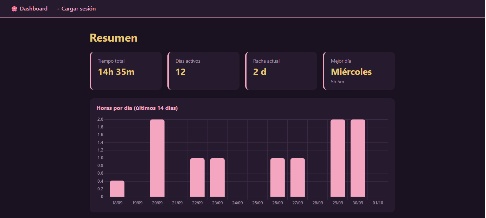
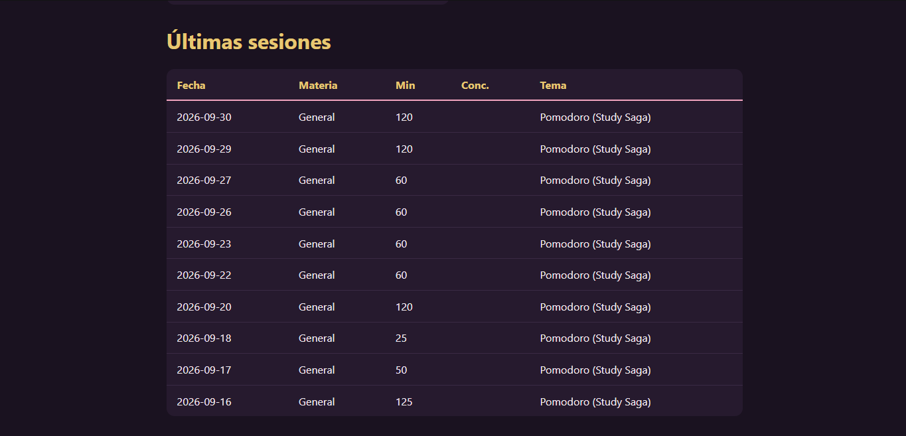
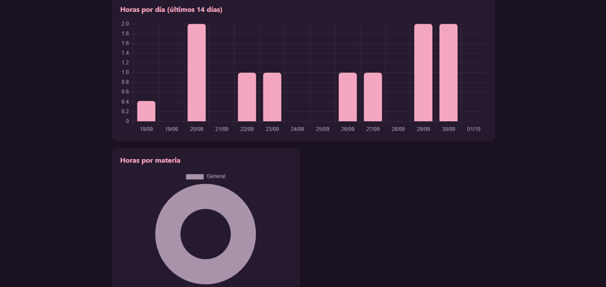

# 🌸 Dashboard de estudio

App web en Flask para registrar mis sesiones de estudio y ver mis hábitos en gráficos.

## Qué hace

- Formulario para cargar sesiones: materia, minutos, concentración (1 a 5) y tema.
- Tarjetas de resumen: tiempo total, días activos, racha actual y mejor día de la semana.
- Gráficos con Chart.js: horas por día (últimos 14 días), horas por materia y concentración promedio.
- Guarda todo en un CSV local; si no existe, la app lo crea sola.

## Tecnologías

Python · Flask · pandas · Chart.js · HTML/CSS

## Cómo correrlo

```powershell
python -m venv .venv
.venv\Scripts\Activate.ps1
pip install -r requirements.txt
python app.py
```

Después abrí http://127.0.0.1:5000 en el navegador.

## Notas

- Mis datos están en `datos/sesiones.csv`, que no se sube al repo (está en el `.gitignore`).
- Importé mi historial desde el timer pomodoro de Study Saga y lo validé contra su reporte (14h 35m, 12 días activos).

## Capturas



